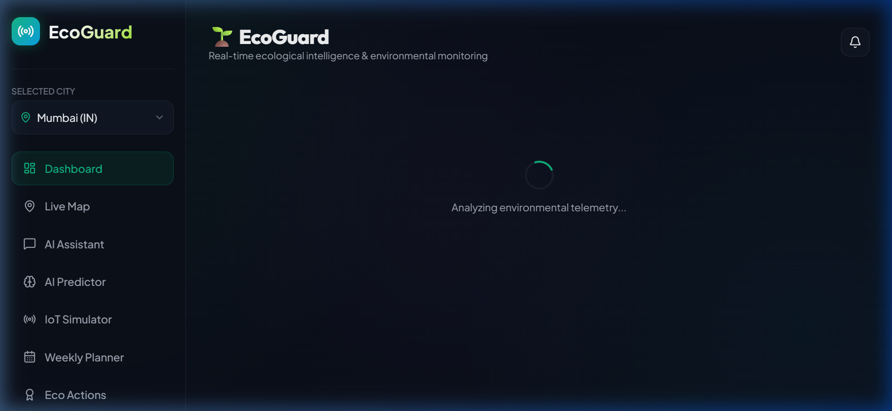
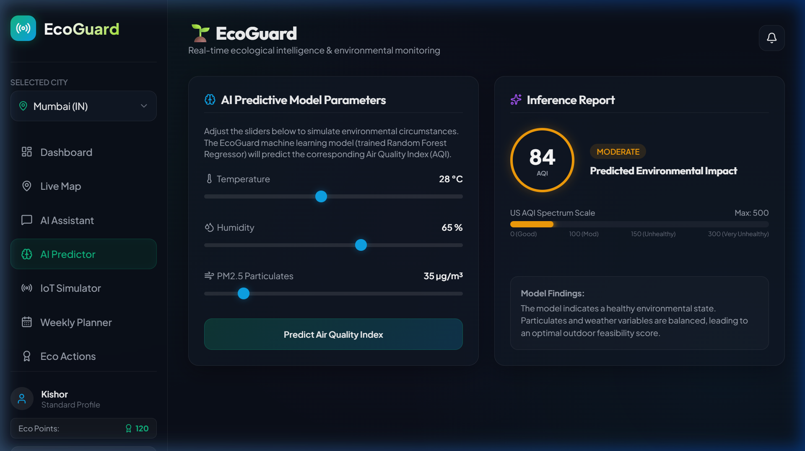
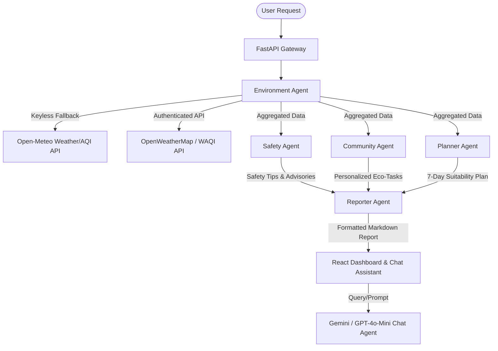

# 🌱 EcoGuard PRO

[](https://python.org)
[](https://vite.dev)
[](https://react.dev)
[](https://fastapi.tiangolo.com)
[](#)

**EcoGuard PRO** is an enterprise-grade, AI-driven environmental monitoring and sustainability platform. By coordinating a **Multi-Agent intelligence architecture**, real-time IoT telemetry pipelines, and predictive Machine Learning models, EcoGuard PRO provides citizens, organizations, and researchers with actionable ecological insights, health alerts, and personalized conservation tasks.

---

## 📸 Application Preview

### 📊 Real-Time Multi-Agent Dashboard


*The EcoGuard PRO Dashboard aggregates real-time geocoded telemetry, pollen levels, and active environmental advisories dynamically using a keyless Open-Meteo fallback.*

### 🤖 AI Predictor & Random Forest Model Inference


*The AI Predictor tab utilizes a locally trained Random Forest Regressor to run real-time air quality forecasts based on Temperature, Humidity, and PM2.5 levels.*

---

## 🧠 Multi-Agent Architecture & Pipeline

EcoGuard PRO leverages a cooperative multi-agent team to fetch, process, safety-audit, and report environmental data:



### 👥 Meet the Agents
1. **Environment Agent (`EnvironmentAgent`)**: Integrates with live geocoded APIs (OpenWeatherMap, WAQI, and keyless Open-Meteo API) to compile current air quality metrics, temperature, humidity, rainfall, and UV exposure.
2. **Safety Agent (`SafetyAgent`)**: Assesses safety levels and correlates data against individual health profiles (e.g., asthmatic sensitivities, high-UV warnings, extreme heat advisories).
3. **Community Agent (`CommunityAgent`)**: Generates custom, context-aware green habits and eco-tasks (e.g., rainwater harvesting suggestions when rain is predicted).
4. **Planner Agent (`PlannerAgent`)**: Projects weekly environmental suitability scores and custom irrigation/plant-care regimens.
5. **Reporter Agent (`ReporterAgent`)**: Consolidates agent telemetry into standardized, exportable markdown reports.
6. **AI Chat Assistant (`EcoGuard AI`)**: Contextual assistant powered by **Gemini 2.5 Flash** (or **GPT-4o-Mini**) to provide interactive environmental advice.

---

## 🛠️ Technical Stack & Dependencies

### 💻 Frontend
- **Framework**: React 19 (Vite-powered SPA)
- **Styling**: Vanilla CSS (Custom Glassmorphism Design System)
- **Charts**: Chart.js (`react-chartjs-2`)
- **Icons**: Lucide React

### ⚙️ Backend
- **Framework**: FastAPI (Asynchronous Python)
- **Web Server**: Uvicorn
- **Environment Management**: Python-dotenv & Pydantic v2
- **Network Requests**: Requests (with fallback fallback triggers)

### 🧠 Machine Learning
- **Library**: Scikit-Learn (Random Forest Regressor)
- **Model Storage**: Joblib serialization
- **Training Data**: Synthetic data pipeline modeling temperature, humidity, and PM2.5 relationships.

---

## 📂 Project Structure

```bash
EcoGuard_New/
│
├── backend/                  # Python FastAPI API & ML Pipeline
│   ├── venv/                 # Python Virtual Environment (gitignored)
│   ├── app.py                # Main backend server and agent classes
│   ├── train_model.py        # Model training script
│   ├── aqi_model.pkl         # Trained Random Forest Regressor (gitignored)
│   ├── requirements.txt      # Backend Python dependencies
│   └── .env                  # Secrets configuration (gitignored)
│
├── frontend/                 # React UI Client
│   ├── dist/                 # Production production build (gitignored)
│   ├── node_modules/         # Package manager dependencies (gitignored)
│   ├── src/
│   │   ├── assets/           # Media & static graphics
│   │   ├── components/       # Dashboard tabs (MapTab, EcoTab, PlannerTab, etc.)
│   │   ├── App.jsx           # Main React App interface
│   │   └── index.css         # Custom premium CSS variables and styles
│   ├── package.json          # Node dependencies
│   └── vite.config.js        # Vite configurations
│
├── .gitignore                # Root gitignore configuration
├── dashboard.png             # Application Dashboard Screenshot
├── predictor.png             # Application Predictor Screenshot
└── README.md                 # Project Documentation
```

---

## ⚙️ Installation & Setup

### 1️⃣ Clone the Repository
```bash
git clone https://github.com/Kishor055/EcoGuard.git
cd EcoGuard
```

### 2️⃣ Backend Configuration & Server Setup
Create a virtual environment, install requirements, and run the FastAPI server:

```bash
cd backend
python -m venv venv

# Windows:
.\venv\Scripts\activate
# Linux/macOS:
source venv/bin/activate

pip install -r requirements.txt
```

#### Train the ML Model
Generate the synthetic training data and calibrate the Random Forest Model:
```bash
python train_model.py
```

#### Setup Environment Variables (`.env`)
Create a `.env` file inside the `backend` directory (do not commit this):
```ini
# API Keys & Tokens
OWM_API_KEY=your_openweathermap_api_key
WAQI_TOKEN=your_waqi_api_token
GEMINI_API_KEY=your_google_gemini_api_key
OPENAI_API_KEY=your_openai_api_key
```
*Note: If no API keys are provided, the system seamlessly falls back to Open-Meteo keyless APIs and rule-based conversational scripts.*

#### Run the FastAPI Backend
```bash
uvicorn app:app --host 127.0.0.1 --port 8000 --reload
```

---

### 3️⃣ Frontend Client Setup
Install the Node dependencies and run the Vite hot-reloading dev server:

```bash
cd ../frontend
npm install
npm run dev
```
Open **`http://localhost:5173/`** in your browser to view the application.

---

## 📈 Use Cases & Impact

- 🌁 **Urban Pollution Forecasting**: Empowers citizens in high-smog cities to plan outdoor activities.
- 🌾 **Smart Agriculture / Home Gardening**: Suggests tailored irrigation adjustments based on precipitation metrics.
- 🫁 **Health Risk Management**: Provides protective alerts for asthmatic and allergy-sensitive groups.
- ♻️ **Actionable Conservation**: Tracks micro-habits that reduce energy consumption and waste production.

---

## ⭐ Support & Contributions

Contributions are welcome! Please follow these guidelines:
1. Fork the project.
2. Create a feature branch (`git checkout -b feature/NewFeature`).
3. Commit your changes (`git commit -m 'Add NewFeature'`).
4. Push to the branch (`git push origin feature/NewFeature`).
5. Open a Pull Request.

---

### 📌 Development Lead
**KISHOR KAKDE PATIL**  
[GitHub Profile](https://github.com/Kishor055)

---
*Developed with ❤️ to protect our environment and promote sustainability.*
